A Context-Aware Click Model for Web Search
======

先看看模型整体架构

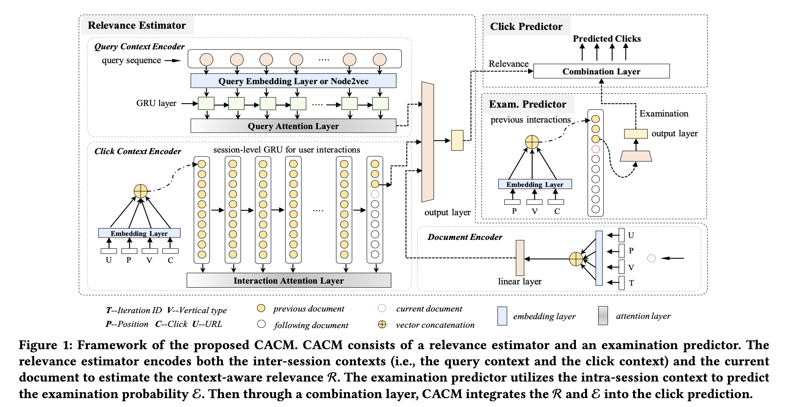

# Definition

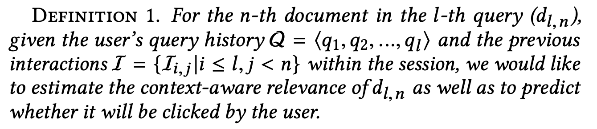

# Framework
主要包括Relevance Estimator、Examination Probability Predictor以及Click Predictor

## Relevance Estimator

### Query context encoder
采用query-query、url-url、qury-url图模型，node2vec获得embedding，GRU+attention编码

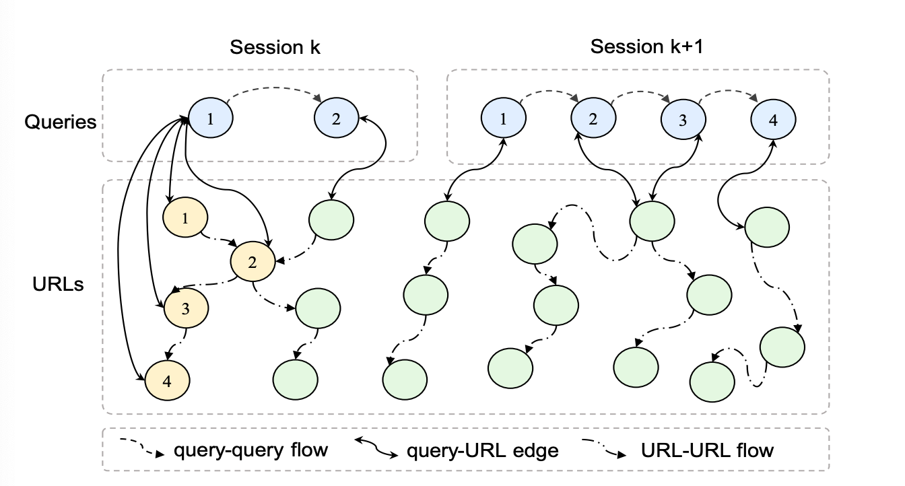

其中，变得权重定义

- query-query，paper中给的固定值2.0

- query-url
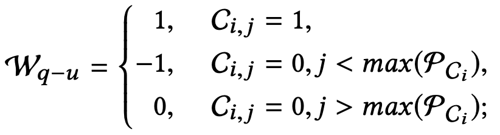
$C_{i,j}$表示$query_i$和$url_j$的状态（点击or不点击）。$max(P_{C_i})$表示$query_i$下点击的$query$中最大位置

- url-url
 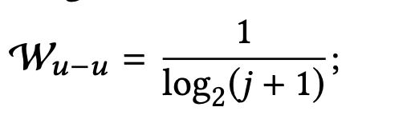

### Click context encoder
Session level GRU编码用户多个session的点击行为
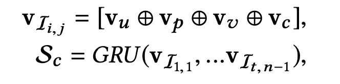
其中，$V_u$表示url的embedding，$V_p$表示文档的position（最大取10），$V_v$表示文档的垂直内容形式（类似百科、图集这种，总共19种），$V_c$表示是否点击。

最后，gru的输出向量过一遍attention layer
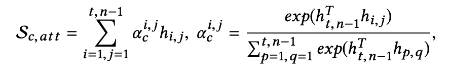

### Document encoder
对当前用户看到的doc编码，做法跟Click context encoder类似
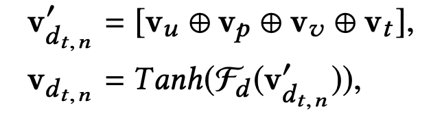
这里的T指的是query的query iteration_id

最后，结合query context encoder、click context encoder、document encoder的输出，经过MLP输出relevance score
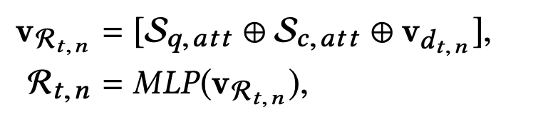

## Examination Estimator
假设exam取决于用户行为，和文档内容无关，GRU编码当前session中之前的用户行为，其他的跟上述encoder没有区别
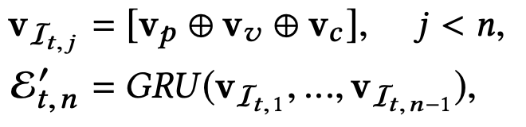

## Click Prediction
基于一个假设，只有当用户exam到一个doc，并且对doc感兴趣，才会点击这个doc，因此将exam score和relevance score结合起来预估ctr。
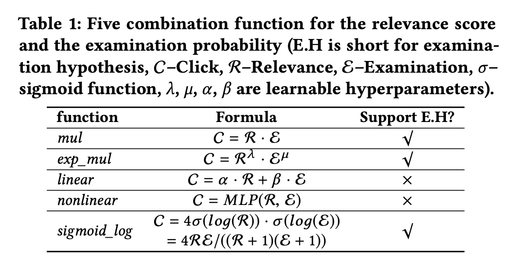

# Experiment Results
对比业界其他click model的效果，这里不做列举，一些基于结构和参数的分析，有参考意义，分享一下：
- 引入图模型embedding、attention机制以及query频次都有正向帮助
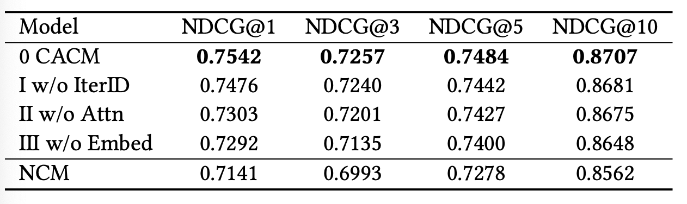

- session长度越长，效果更明显
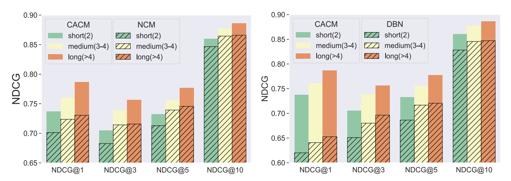

- 越接近当前query的用户行为，重要性越大；利用了context信息，比如d(1,3)没有点，在d(4,3)上就给了更低的相关性得分
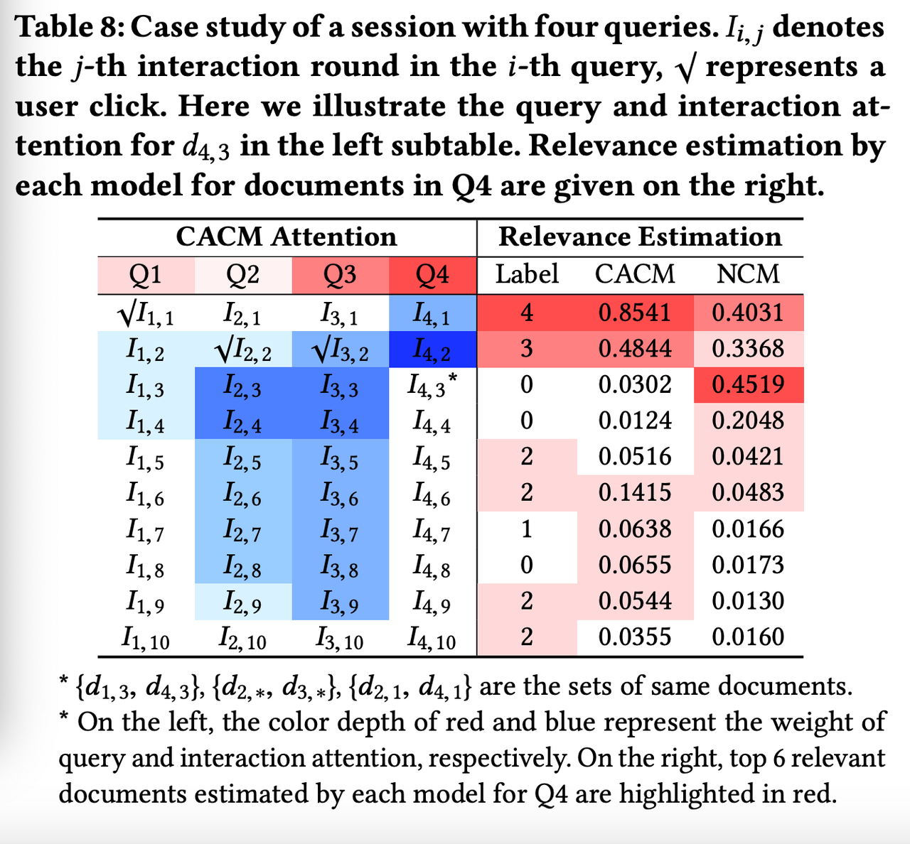
