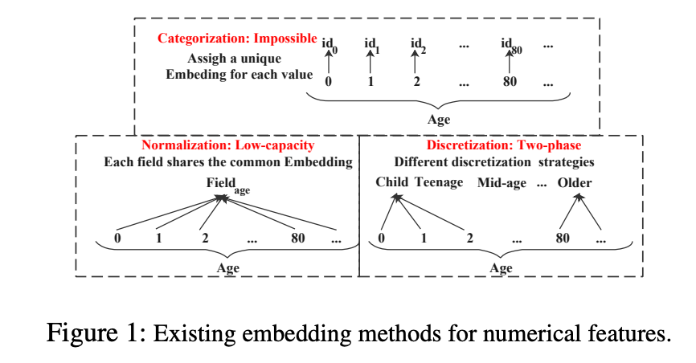
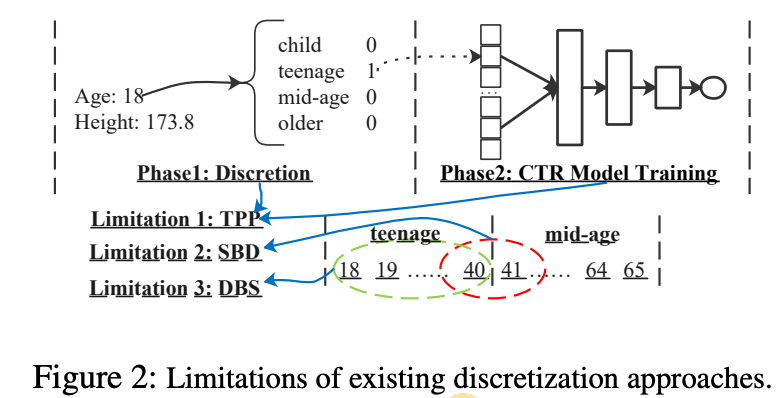
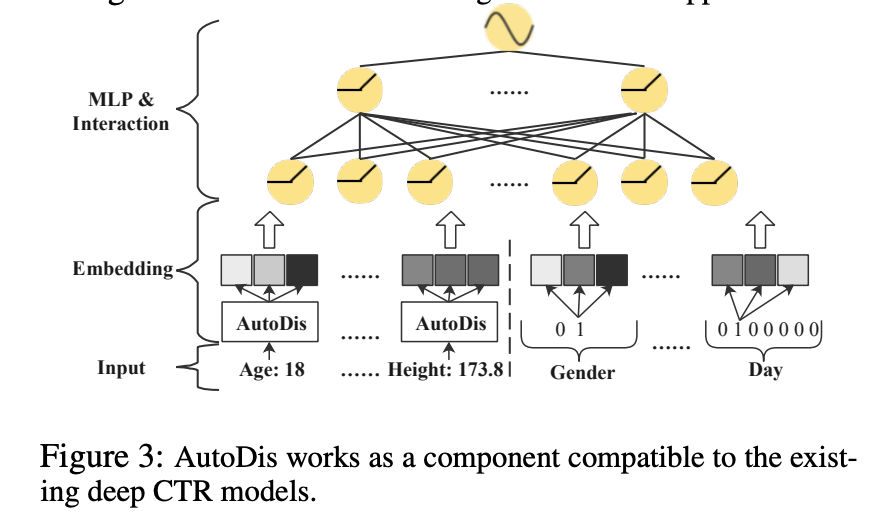
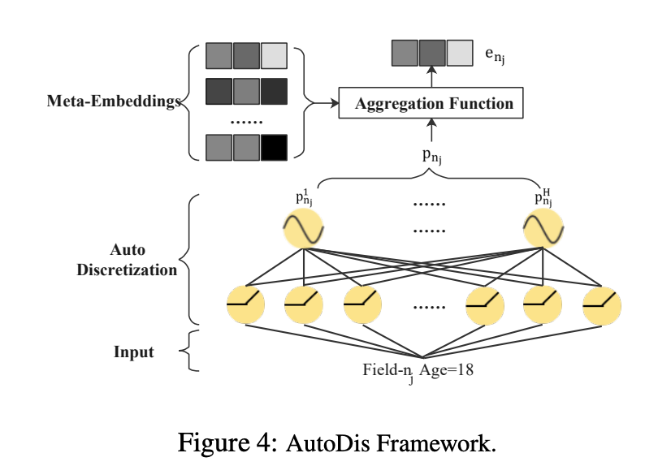
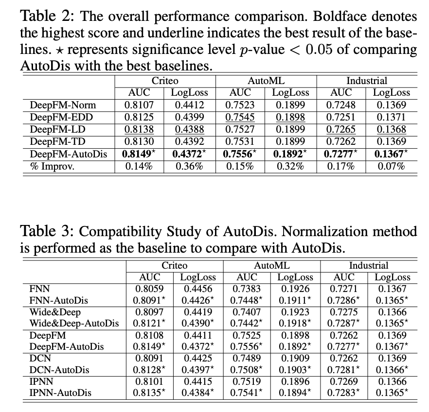

AutoDis: Automatic Discretization for Embedding Numerical Features in CTR Prediction
==============

# Abstract
计算广告的ctr预估模型的特征主要分为两类：categorical特征和numerical特征，两种特征都需要embedding化才能供深度模型使用。常用的numerical特征embedding化有两种方法：Normalization和Discretization。

Normalization方法是每类特征共享一个embedding，Discretization是将特征离散化后再转化成embedding。前者表达能力有限，后者由于离散化的规则不能和模型一起优化导致效果没有保证。本文提出了AutoDis方法，以end-to-end的方式优化离散化规则和ctr模型，该方法为每个numerical类特征引入embedding集合来建模特征内部的关系，然后提出了自动化的离散化和聚合方法来捕捉特征与embedding的相关关系。

# Motivation
现有numerical特征的embedding化方法
1. **Categorization**：给每个特征取值都分配一个embedding，独立优化，只适用于取之较少的特征
2. **Normalization**：特征共享一个embedding，特征取值和embedding的乘积作为最终embedding
3. **Discretization**:将特征取值离散化，分为多个桶，然后为每个桶分配一个embedding

**Discretization**方法的限制：TPP（Two-Phase Problem）、SBD（Similar value But Dis-similar embedding）、DBS(Dis-similar value But Same embedding)

# AutoDis 

基于现有方法的缺点，本文提出了AutoDis能够end-to-end的学习numerical特征的embedding，能直接应用在现有的深度模型当中。

AutoDis为每个numerical特征(如age,gender等)设计了一组 meta embedding $ME_{n_j} \in R^{H_j \times d}$，然后利用一个参数向量$w_{n_j} \in R^{H_j}$产生每个特征取值$x_{n_j}$对应$ME_{n_j}$的score
$$\hat x_{n_j}^h=w_{n_j}^h\cdot x_{n_j}$$
$$h \in [1,H_j]$$
$$p_{n_j}^h=\frac {e^{\frac 1\tau \hat x_{n_j}^h }}{\sum_{l=1}^{H_j}e^{\frac 1 \tau \hat x_{n_j}^l}}$$
然后根据计算出来的分数p聚合ME，例如Max-Pooling, Top-K-Sum, Weighted-Average等

# Experiments

