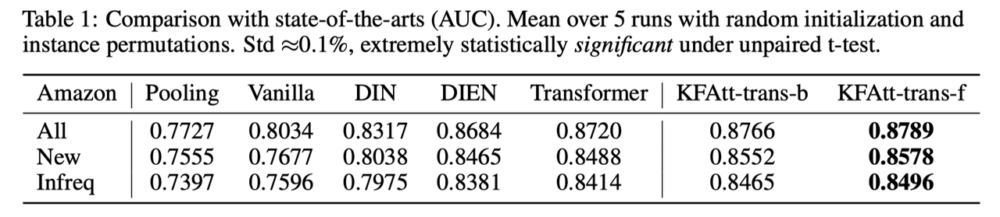

Kalman Filtering Attention for User Behavior
Modeling in CTR Prediction
===

# Introduction
- 目前可解决
  - 与当前query更相关的行为赋予更高的权重，与当前query无关的行为赋予较低的权重
- 目前仍不能解决的问题：
  - 传统attention隐含的基本假设：用户此刻的兴趣一定会被历史行为覆盖；然而在电商场景中，**用户当前感兴趣的经常是与他们历史行为均无关的新商品**；在这种情况下，无论权重如何分配，得到的加权和都无法刻画用户此刻的兴趣。
  - 传统attention将所有用户行为等价看待，由于电商场景下不同类型商品的用户行为存在频次不均的问题（食品、消耗品的购买行为频次高，奢侈品、电器的购买行为频次低），在加权求和的过程中，**高频用户行为会获得更大的权重，导致用户兴趣偏好预估有偏**
- 为了解决以上两个问题，提出了新的attention机制——Kalman Filtering Attention (**KFAtt**)，将attention中的weighted pooling视作**最大后验概率估计**（Maximum a Posteriori, MAP)
  - 引入与当前query相关的先验分布，当前用户与query相关的历史行为稀疏时，KFAtt将自动考虑全局所有用户在该query上的主流行为，**使attention不再局限于单个用户的历史行为**。
  - 引入频次控制机制，将相同query下的行为归并在一起，避免计算结果倾向于高频行为

# Preliminaries
简单讲下attention和Kalman Filtering
## Attention
常见的CTR模型结构可表示如下：
$$CTR=f(query, user\ behaviors, user\ profile, iterm\ profile, contexts)$$
其中我们比较关心的是如何将user behaviors转化为合理的向量表示：
$$\hat v_q=User-Behavior(q,k_{1:T},v_{1:T})$$
- $\hat v_q$：用户在当前query下的兴趣向量
- $T$：用户历史行为的数量
- $v_{1:T}$：用户过去$T$次历史点击行为
- $k_{1:T}$：发生历史行为的$T$个query

传统的attention机制可表示为
$$\hat v_q=\sum_{t=1}^T\alpha_tv_t$$
$$\alpha_t=\frac {exp(\mathbf{q}^\mathsf{T}k_t)}{\sum_{\tau=1}^T exp(\mathbf{q}^\mathsf{T}k_\tau)}$$

## Kalman Filtering
> [https://zhuanlan.zhihu.com/p/39912633](https://zhuanlan.zhihu.com/p/39912633)

卡尔曼滤波：基于一系列观测量来计算系统在某时刻的真实状态的估计值；非常适合不断变化的系统，它的优点还有内存占用较小（只需保留前一个状态）、速度快，是实时问题和嵌入式系统的理想选择

论文里并没有用到卡尔曼滤波很复杂的细节，了解几个基本概念就可以

- 待估计状态：$x_k=(p, v)$

- 传感器：机器人的GPS传感器、机器人内部的速度表盘

- 观测值：GPS的位置读数、机器人的速度读数

- 两个高斯分布
    - 位置p和速度v服从高斯分布，均值是真实状态值
    

    - 同时，传感器本身的读数（测量值）也存在噪音，我们也假设它服从高斯分布
    

# Kalman Filtering Attention for User Behavior Modeling

## Details
用户对当前query $q$ 的兴趣偏好由 $v_q$表示，假设该变量服从高斯先验分布：
$$v_q\sim N(\mu_q,\sigma^2_qI)$$

$v_q$刻画不同用户在相同query下的兴趣偏好。理想情况下，$\mu_q$代表着所有用户兴趣偏好的平均值，$\sigma_q$代表着各用户兴趣分布的差异

> - 越具体的词，兴趣分布差异越小，例如，"new year gift"的$\sigma_q$很大，但"Nike runing shoes"的$\sigma_q$较小；

具体实现中，$\mu_q$、$\sigma_q$是将$q$经过2层MLP得到。

卡尔曼滤波按如下方式对$v_q$作出合理的估计：

1. 将用户历史点击行为$v_{1:T}$视作用户兴趣$v_q$的$T$次独立的观测值
2. 对应的历史query $k_{1:T}$视作uncertainty不同的$T$个传感器

我们假设这些观测值$v_{1:T}$也服从高斯分布：
$$v_t|v_q\sim N(v_q, \sigma_t^2I), t\in \{1,\cdots,T\} $$
其中，$\sigma_t$以来传感器$k_t$和待测量值的距离，即当前query和历史$query$的距离

于是可以获得$v_q$的最大后验概率估计，其中$\phi$是高斯分布的概率密度函数：

$\hat v_q$可以推导出解析解的形式，这其实就是一种attention的形式，我们称其为**KFAtt-base**

**proof:**

## Remarks
- 通过引入兴趣先验，$\mu_q$可以帮助模型从其他用户的兴趣表达中学到当前用户额先验。$\sigma_q$可以帮助KFAtt-base在兴趣先验和用户行为后验间折中
- 出现与历史行为均不相关的新query时，各行为对应的$\sigma_t$都很大，此时占主导作用的是先验，先验包含了其他用户在该query下的平均行为。
- 当满足$\sigma_1=\infty$ 且 1/$sigma_t^2=exp(\mathbf{q}^\mathsf{T}k_t$)时，KFAtt-base退化成普通attention
- 对于DIN等现有模型，将公式中的1/$\sigma_t^2$赋值为原模型中attention weight，然后再多学两个q相关的先验参数，即可切换成KFAtt-base

# Kalman Filtering Attention with Frequency Capping

## Details
上一节提出的KFAtt-base将历史query $\mathbf{k}_{1:T}$视为相互独立的传感器，然而这里存在很多重复的query。为了避免计算结果对高频行为的倾向，**KFAtt-freq仅将去重后的query看做传感器，同一query下的不同行为看做同一传感器的多次重复测量**。

现在传感器的个数变为$M$（$M \leq T$），传感器$\mathbf{k}_{1:M}$对应去重后的query，其中$\mathbf{k}_m$拥有$n_m$次观测行为$[\mathbf{v}_{m,1},\cdots,\mathbf{v}_{m,n_m}]$，显然$\sum_{m=1}^Mn_m=T$。

测量值$\mathbf{v}_{m,t}$的误差由两部分组成：
1. 系统误差$\sigma_m$：传感器$\mathbf{k}_m$本身和目标$\mathbf{q}$的差距越大，系统误差越大。我们用高斯分布刻画系统误差，设$\mathbf{v}_m$是排除噪声后，传感器$\mathbf{k}_m$的理想测量值
$$\mathbf{v}_m|\mathbf{v}_q\sim \mathbf{N}(\mathbf{v}_q,\sigma_m^2I), m \in \{1, \cdots, M\}$$

2. 测量误差$\sigma_m'$：传感器精度带来的误差，可通过多次重复测量降低。实际观察到的测量值$\mathbf{v}_{m,t}$可表示如下
$\mathbf{v}_{m,t}|\mathbf{v}_m\sim N(\mathbf{v}_m, \sigma_m^{'2}I), t \in \{1,\cdots,n_m\}$
<bar>其中，$\sigma_m'$由$\mathbf{k}_m$经过两层MLP得到。

与KFAtt-base类似，可以获得$\mathbf{v}_q$的最大后验概率估计和对应解析解

其中$\mathbf{v}_m = \frac{1}{n_m} \sum^{n_m}_{t=1} v_{m,t}$是传感器 $\mathbf{k}_m$在所有测量值上的平均值

## Remarks
用户行为的权重依旧和query间的距离$\sigma_m$相关，但不随着query出现的频次线性增长；当$n_m$趋于正无穷时，测量趋近于0，但由于系统误差的存在，高频行为的权重得到了限制

# Kalman Filtering Attention in Real Online System：KFAtt-trans
- 基于transformer的encoder：用于刻画捕捉行为序列间的correlations，将行为序列切分成若干session，每个session内部计算self-attention，并得到代表session兴趣的向量$H_s$
- 基于KFAtt的decoder：预测query-specific的用户兴趣向量，attention对应的$V$是encoder的输出$H_s$

# Experiment Results
- 数据集信息：Amazon Dataset
  - 1,689,188 instances
  - 192,403 users
  - 63,001 goods from 801 categories
- 任务
  - 给定用户给商品写过的历史评论列表，预测用户是否会给target item写下评论
  - behavior v：the reviewed item
  - q ：the category of target item
  - k ：the category of reviewed item

- KFAtt-trans与其他SOTA模型的效果对比

- 直接将其他对比模型的attention机制修改为KFAtt-base/KFAtt-freq

- 性能对比，跟Transformer差不多，优于DIEN

