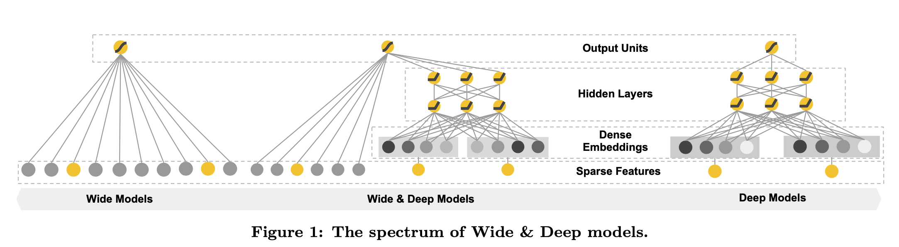

Wide & Deep Learning for Recommender Systems
===

先来看看模型结构

wide部分负责Memorization，学习物品或特征的共现频率，挖掘历史数据中可用信息，基于用户已有的喜好推荐物品

deep部分负责Generalization，学习很少出现的特征组合，探索用户可能的喜好，提高推荐物品的多样性。

# Recommender System
推荐系统的整体pipeline

- 当用户访问推荐网站时，会形成一个包含user、context的query
- 推荐系统根据query，从数据库中retrieval出与query匹配度较高的item list，长度大概是$O(100)$量级
- Rank模块调用模型给上一步的item预估出一个分数（ctr,cvr or ecpm），根据分数对item list进行排序，并截断$O(10)$的物品展现给用户
- (query, item, user action)信息落log，供排序模型训练

# Wide & Deep Learning
1. Wide部分是一个线性模型，$y=w^Tx+b$，特征集包含原始输入特征、人工设计的交叉特征（cross-product transformation)

2. Deep部分是一个MLP，原始的categorical特征首先映射成低维embedding，然后进入MLP
$$a^{(l+1)}=f(W^{(l)}a^{(l)}+b^{(l)})$$

3. Wide和Deep的输出值加起来，由SGD联合训练。Wide部分优化器采用FTRL，Deep部分优化器采用AdaGrad。模型预估公式：
$$P(Y=1|x)=\sigma(w_{wide}^T[x,\phi(x)]+w_{deep}^Ta^{(l_f)}+b)$$

# Syetem Implementation
app推荐系统的pipeline主要包含三个阶段：data generation, model training, model serving

## Data Generation
这个阶段利用用户数据、app曝光数据生成模型的训练数据

Vocabularies，将categorical特征映射成IDs，连续性real-value特征被norm到[0,1]区间，通过$x$的累计概率分布将$x$分为$n_q$等分，落在i分位区间的值设为$\frac {i-1}{n_q-1}$

## Model Training
线上使用的模型结构

模型上线之前需要验证模型正确性

## Model Serving

模型在线上serving的时候，为了降低延时，需要将batch分成多个mini batch，并行预估。

# Experiment Results

- 离线auc和线上表现都有提升

- 多线程并行预估的延时有显著下降

