Graph Neural Networks in Recommender Systems: A Survey
============
# abstract
随着网上信息爆炸式增长，推荐系统可以帮助人们缓解这种信息过载的问题，最近几年出现了大量关于推荐系统的研究工作，图神经网络也在很多领域取得了非常好的效果。推荐系统的关键挑战是从用户-物品的交互信息(interactions)以及其他辅助信息(side information)中学到有效的用户和物品表征。由于这些信息天然含有很强的图结构以及图神经网络强大的图结构的学习能力，因此将图神经网络应用在推荐系统中的研究开始出现。

本文将对最近的基于图神经网络的推荐系统的研究工作进行介绍，并对这些研究工作进行分类，给出这一领域的未来研究方向

# introduction
一个好的推荐系统需要精准的捕捉用户的偏好，并给用户推荐感兴趣的物品。通常，推荐系统会基于用户的兴趣和物品的特性来评估用户对物品的偏好程度（score），通过偏好程度来判断是否向用户推荐该物品。推荐系统中用户兴趣以及物品特性通常用一个向量表示（embedding），因此如何从用户-物品的历史交互信息或者其他辅助信息（用户社交网络，物品知识图谱等）中学习精准的用户/物品的embedding，是推荐系统领域的主要挑战。

最近几年，图神经网络技术在很多领域都取得了突出的成果，例如关系抽取、蛋白质结构预测等，图神经网络擅长处理图结构的数据，通过迭代传播捕捉高阶的交互信息。社交网络，知识图谱，用户-物品交互信息都可以看作图结构数据。图神经网络能够有效地学习用户-物品的交互信息，并整合辅助信息，学习到精准的用户/物品embedding。

本文回顾近期基于图神经网络的推荐系统的相关工作，本文的主要贡献如下：
1. 新的分类体系
2. 全面的回顾
3. 未来研究方向

# RS and GNN
本节对推荐系统(RS)以及图神经网(GNN)技术进行介绍，并讨论了在推荐系统中应用图神经网络技术的动机。
## RS
由于推荐系统强大的实用性，其已经成为了互联网应用上不可或缺的功能（电商，广告，资讯等）。而根据是否考虑物品的顺序，推荐系统又可分为
**常规推荐系统(general RS)**
和
**序列推荐系统(sequential RS)**。

常规推荐系统假设用户的偏好是不变的，根据用户对物品的显示（clicks）或隐式反馈（ratings）来建模用户-物品匹配程度，包括用户对目标物品的打分、推荐用户感兴趣的物品列表等。大部分的研究工作将用户-物品的交互建模成矩阵，推荐就是一个矩阵填充的任务。传统的协同过滤（矩阵分解）就是通过学习用户/物品的隐向量来重构交互矩阵。随着深度学习技术的很多领域的出色表现，最近大部分的推荐模型都是用了MLP等神经网络组件。

从图结构的角度看，用户-物品的交互可以看作一个二部图，图的节点表示用户或物品，边表示用户对物品有过交互行为（clicks）。可以利用图神经网络技术从用户-物品的二部图中捕捉用户-物品的交互关系，并学习到有效的用户-物品的embeddings。除了用户-物品交互图之外，其他辅助信息（社交网络，知识图谱）也能用来解决数据稀疏问题，提高推荐系统性能。

序列推荐系统假设用户最近点击的物品反映了用户的动态偏好，其关键技术是通过捕捉前序物品与候选物品的序列化模式，给用户推荐下一个可能点击的物品。常见的技术又Markov Chain、RNN、Self-attention以及GNN等。

## GNN
图神经网络技术可以通过节点间的信息传递捕捉图的依赖关系，关键技术是如何迭代的整合汇聚相邻节点的信息，并整合汇聚的信息和中心节点本身的表征。根据是否使用谱卷积操作（spectral convolution operation），已有图神经网络技术可以分为spectral methods 和 non-spectral methods（又可叫spatial methods），基于谱的方法从图信号处理的角度引入滤波器来定义图卷积，需要计算图的邻接矩阵的正则化拉普拉斯矩阵的特征值，耗费大量的计算资源和内存资源，没办法处理大型图。spatial methods的思想来源于的图像卷积方法，定义汇聚器和更新器，汇聚器负责收集邻居节点的信息，更新节点负责用汇聚的信息和中心节点本身的信息来更新中心节点表征。常见的汇聚器包含mean-pooling操作或者attention pooling。更新器包括GRU，concatenation，sum operation等。

常用的GNN方法变种包含以下四种:

1. [GCN](https://arxiv.org/abs/1609.02907)，节点embedding的更新公式如下：
$$ H^{(l+1)}=\sigma(\hat D - \frac 12 \hat A \hat D - \frac 12H^{(l)}W^{(l)}) $$
$\sigma(\cdot)$表示激活函数，$\hat A=\hat A+I$表示带自连接的邻接矩阵，$\hat D_{ii}=\sum_j \hat A_{ij}$

2. [GraphSage](https://arxiv.org/abs/1706.02216)对相邻节点进行采样，使用mean/LSTM/pooling进行agg，然后使用concat操作进行update，公式如下:
$$n_v^{(l)}=AGGREGATE_t(\{h_u^l, \forall u \in N_v\})$$
$$h_v^{(l+1)}=\sigma(W^{(l)} \cdot [h_v^{(l)}||n_v{(l)}])$$

3. [GAT](https://arxiv.org/abs/1710.10903)中每个相邻节点对中心节点的影响都不一样，通过attention方式更新中心节点，公式如下:
$$\alpha_{vj}=\frac {exp(LeakyReLU(a^T[W^{(l)}h_v{(l)}||W^{(l)}h_j^{(l)}]))}{\sum_{k \in N_v}exp(LeakyReLU(a^T[W^{(l)}h_v{(l)}||W^{(l)}h_k^{(l)}])) }$$
$$h_v^{(l+1)}=\sigma(\sum_{j \in N_v}\alpha_{vj}W^{(l)}h_j^{(l)})$$

4. [GGNN](https://arxiv.org/abs/1511.05493)在更新器中使用GRU操作，更新公式:
$$n_v^{(l)}=\frac1{|N_v|}\sum_{j \in N_v}h_j^{(l)}$$
$$h_v^{(l+1)}=GRU(h_v^{(l)},n_v^{(l)})$$

## Why Graph Neural Network for Recommendation
在推荐系统中应用图神经网络基于以下两个条件：
1. 推荐系统中的大部分数据含有图结构
2. 图神经网络可以捕捉图结构信息，有效学习用户/物品表征

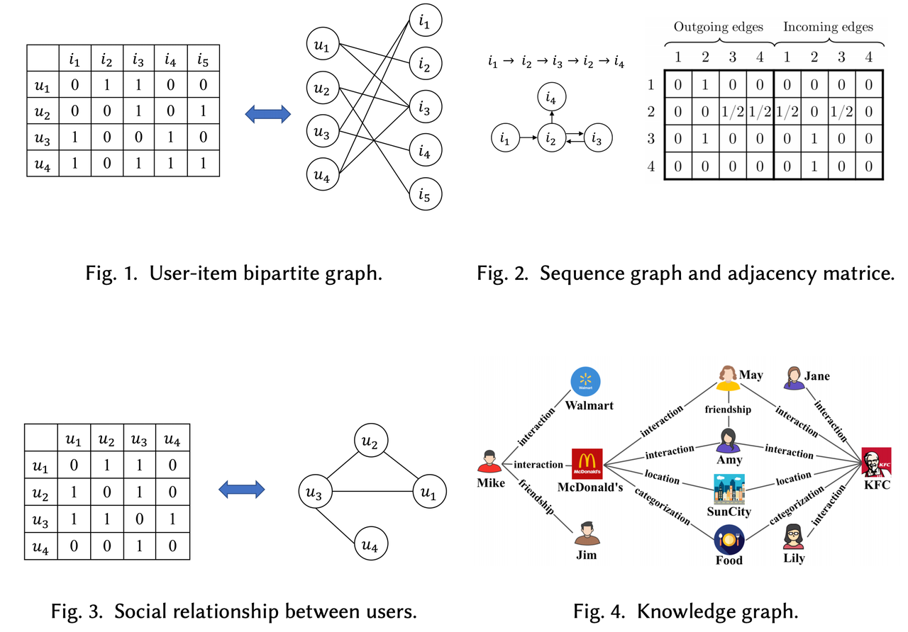

# Categories of Graph Neural Networks based Recommendation
本文根据推荐系统的类型以及使用的信息类型对图神经网络技术进行分类，如图

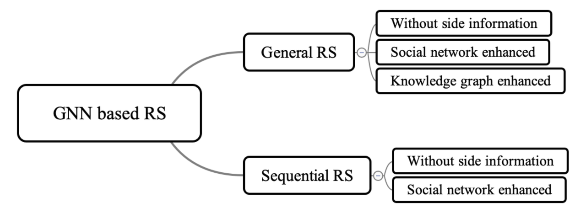

分类方法基于两个事实:
1. 不同类型的数据含有不同的性质，需要采取不同的GNN策略
2. General RS和Sequential RS背后的基本假设不一样

<figure>
    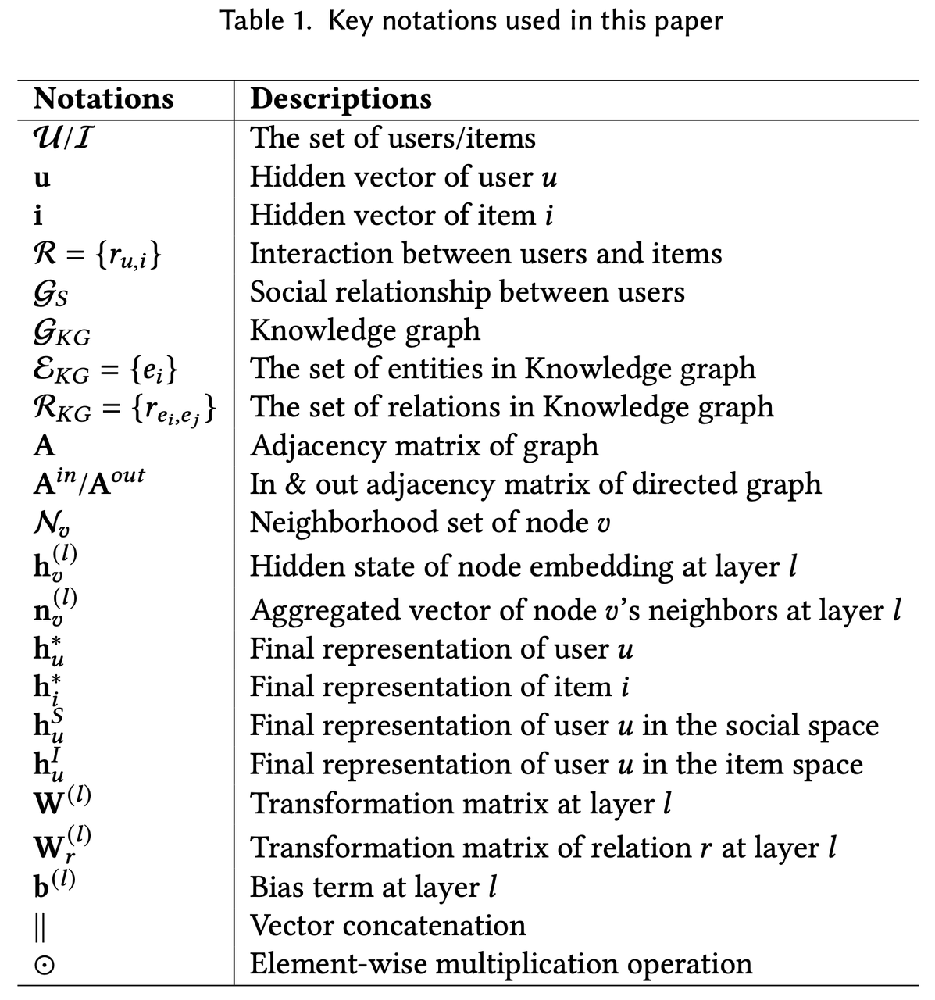
    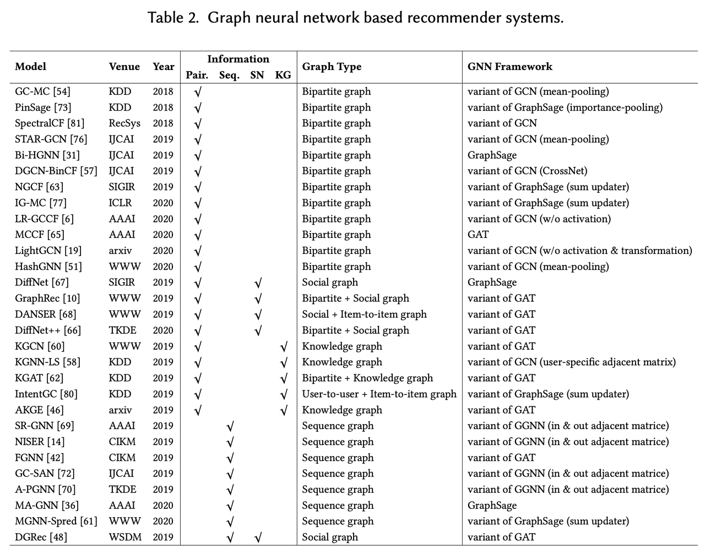 
</figure>

# General RS

General RS基于用户历史的交互数据建模用户偏好，进而给用户推荐一些感兴趣的物品。通常历史交互数据都比较稀疏以及冷启动场景下，推荐系统的性能会急剧退化。为了解决这个问题，一些工作尝试向推荐系统引入额外的辅助信息，例如社交网络、知识图谱等。

本章介绍几个子分类的代表性工作，以及各自的优缺点.

## Without side information

推荐系统的本质是矩阵填充，现有的方法通过分解用户-物品的交互矩阵，得到用户/物品的表征，然后根据学习到的表征推断用户对候选物品的偏好。从图的角度看，用户-物品的交互数据可以表示成一个用户-物品的二部图，用户节点的相邻节点都是物品节点，物品节点的相邻节点都是用户节点。应用图神经网络技术学习用户-物品的高阶交互信息，利用用户点击过的物品加强用户的表征，利用点击过物品的用户加强物品的表征。

### Overall framework

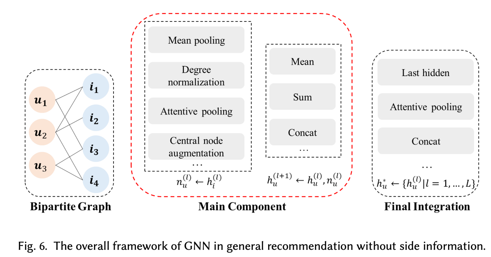

这套方法的关键挑战是如何传递物品的信息到用户，传递用户的信息到物品。主要问题是以下四个方面
1. 图构造。二部图包含用户节点，物品节点和用户和物品的交互（边）。考虑到计算资源问题，需要从邻居节点中采样有代表性的节点进行计算
2. 邻居节点聚合。如何聚合邻居节点的信息到中心节点，或者是需要传递多少信息到中心节点。
3. 信息更新。如何根据聚合的信息更新中心节点的信息
4. 节点表征。如何根据节点的信心输出最终的节点表征

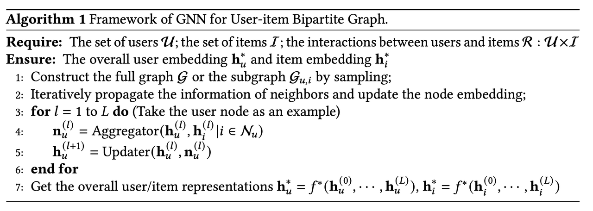

### Representative methods

1. [GC-MC](https://arxiv.org/abs/1706.02263)解决评分预测问题。它的二部图有用户，物品以及物品给用户的评分构成。该方案中节点的信息只由相邻节点决定，忽略了节点本身包含的信息。并且相邻节点对中心节点的影响都是相等的。信息传递公式： 
$n_u=\sigma(\sum_{r \in R_r}\sum_{i \in N_r(u)}\frac 1{|N_u(r)|}W_rh_i)$
 
$h_u^I=\sigma(Wn_u)$

其中，$R_r$表示分数类型，$N_u(r)$表示节点u中评分类型$r$的度，$W_r$表示评分类型$r$的学习矩阵.
 GC-MC只考虑了一跳信息，没办法利用更多的图结构信息。并且忽略节点本身的信息，可能会忽略用户的偏好以及物品的特性。

2. [STAR-GCN](https://arxiv.org/abs/1905.13129)堆叠多个完全相同的GCN块，例如GC-MC。之所以堆叠多个GCN块而不是直接使用多层GCN的原因在于多层GCN容易导致over-smoothness问题。在每个块之间引入reconstruction机制将聚合的表征恢复节点的初始输入，然后reconstruction的表征又作为下一个块的输入，网络结构如
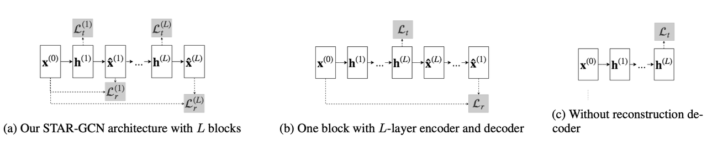
该方案考虑到了label泄漏的问题，在训练过程成随机mask一些节点，并增加了这些节点的reconstruction loss。

3. [NGCF](https://arxiv.org/abs/1905.08108)利用多层GNN网络来捕捉高阶交互信息，每个物品节点对中心节点的信息贡献不同，最终concat多层表征来表示节点的embedding
$$n_u^{(l)}=\sum_{i \in N_u} \frac 1{\sqrt{|N_u||N_i|}}(W_1^{(l)}h_i^{(l)}+W_2^{(l)}(h_i^{(l)}\circ h_u^{(l)}))$$
$$h_u^{(l+1)}=LeakyReLU(h_u^{(l)}+n_u^{(l)})$$
$$h_u^{(I)}=h_u^{(0)}||\cdots||h_u^{(L)}$$
$$h_i^{(U)}=h_i^{(o)}||\cdots ||h_i^{(L)}$$
$$\hat {y}_{NGCF}(u,i)=h_u^I\top h_i^U$$

4. [PinSage](https://arxiv.org/abs/1806.01973)结合了随机游走和图卷积操作来学习节点embedding。和其他从整个图中学习不同，该方法设计了随机游走算法，随机采样了固定个数的临界点（不只是一阶）。每个邻节点有一个权重控制相对于中心节点的重要程度，为了训练稳定，每个节点embedding会经过标准化之后在进行下一次计算。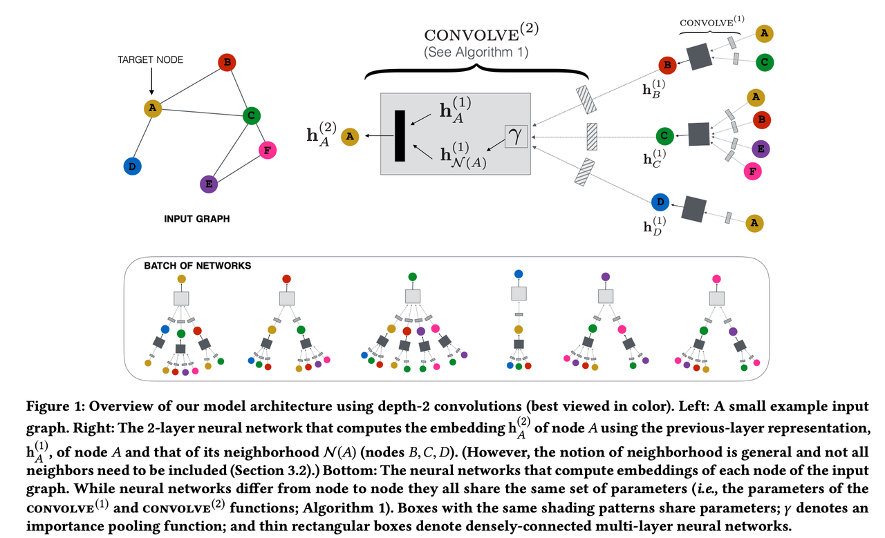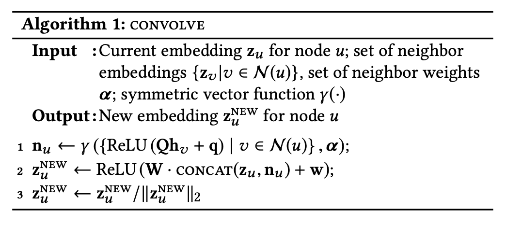
节点的最终输出为
$$h_u^I=G_2\cdot ReLU(G_1h_u^{(L)}+g)$$

5. IG-MC为用户-物品对构造一个一跳的子图，具体是给定一个用户-物品对，构造包含用户点击过的物品以及点击过目标物品的用户的子图，这种子图提取方式减少了对于原图的依赖，避免了数据稀疏场景下的推荐效果下降以及增加了推荐系统的泛化性。信息传递方式和GC-MC相同，但是保留了中心节点本身的embedding，更新公式为 
$h_u^{(l+1)}=W_0^{(l)}h_u^{(l)}+\sum_{r \in R_r}\sum_{i \in N_u(r)}\frac 1{|N_r(u)|}W_r^{(l)}h_i^{(l)}$

 最后，不同层的vector concat起来作为节点最终的embedding

### Summary
接下来从以下四个方面归纳下前文介绍的代表性方法
1. **构图**。GNN构造多层网络，迭代地从一跳邻居节点传递信息。随着层数增加，节点的规模会越来越来，会耗费大量的计算资源，为了大规模的应用到实际工业生产中，必须对邻居节点进行采样。例如，PinSage使用随机游走算法采样固定数目的邻居节点，IG-MC对目标用户-物品构造子图。如何采样需要在原始图信息以及计算效率之间作trade-off。
2. **邻节点聚集**。邻节点的信息聚集分为四种方式：mean-pooling平等对待所有邻节点；degree normalization基于图结构给每个邻节点分配权重；attention-pooling利用注意力机制区别对待每个邻节点；central node augmentation考虑了节点间的关系，利用中心节点过滤邻节点的信息。总的来说，区别对待邻节点的效果好于平等对待邻节点。
3. **信息更新**。大部分工作会组合中心节点本身的信息以及邻节点聚集的信息。常用的组合方式包活mean-pooling、sum-pooling、concat。其中concat会引入更多的特征交叉
4. **节点表征**，输出节点表征的方法包括：使用最后一层GNN的输出作为最终的节点embedding；组合不同GNN层的输出作为最终的节点embedding，组合方式有wieghted-pooling和concat。因为不同层的输出表达不同的连接方式，所以效果会更好。

## Social network enhanced

随着线上社交网络的发展，很多工作尝试将社交关系引入推荐系统中，以解决数据稀疏以及冷启动问题。社交网络是一个同构图，节点都是用户，边是用户间的社交关系。如同用户-物品交互网络，社交网络中的信息是可以传递的，例如一个用户的偏好可能被他朋友的朋友所影响，因此可以使用GNN来捕捉这种影响关系。

### Overall framework
现有工作利用用户间的交互行为和关系在推荐系统汇中引入社交影响，提高推荐系统的表现。社交图有两个特点：图中的边表示用户间的关系，这种关系有强有弱；从社交图中学习的知识对用户-物品交互是一种补充，可以增强用户表征。对应这两个特点，引入社交网络有以下两个问题需要解决：
1. 所有朋友的影响都是相等的吗？如果不是，怎么区分不同朋友的影响呢？
2. 用户和朋友间有社交关系，用户和物品间有交互关系，如何组合社交关系和交互关系呢？有以下两种方式
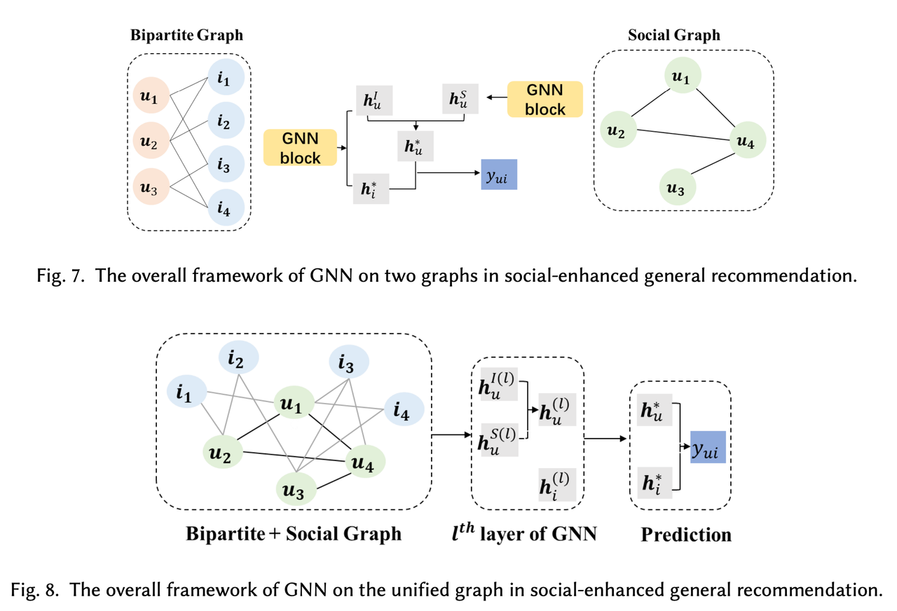
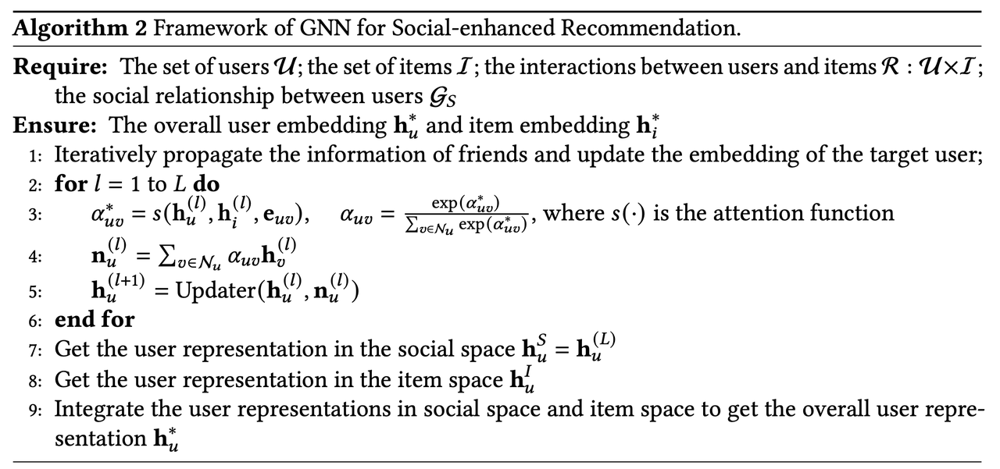

### Representative methods
1. [DiffNet](https://arxiv.org/pdf/1904.10322.pdf)利用用户社交关系以及用户行为来建模用户偏好，使用graphSage算法框架从社交图中提取信息，利用mean-pooling聚合朋友的表征作为用户在社交空间的embedding，利用mean-pooling聚合物品的表征作为用户在物品空间的embedding，最后的预估分数为
$$\hat r_{ui}=h_i\top(h_u^S+\sum_{j \in R_u}\frac {h_j}{|R_u|})$$

2. [GraphRec](https://arxiv.org/pdf/1902.07243.pdf)分别学习社交网络和用户-物品二部图中的用户embedding。朋友对用户的影响大小取决于用户和朋友embedding的相似程度，计算公式如下
<bar>
$\alpha_{uv}^\ast=v_a\top\sigma(W_a\cdot [h_v^{(l)}||h_u^{(l)}])$
 最后将社交网络空间的用户embedding和物品空间的用户embedding连接起来，经过MLP输出最终的用户embedding
$$c_1=[h_u^I\oplus h_u^S]$$
$$c_2=\sigma(W_2\cdot c_1+b_2)$$
$$\vdots$$
$$h_u=\sigma(W_l\cdot c_{l-1}+b_l)$$

3. [DANSER](https://arxiv.org/pdf/1903.10433.pdf)现有模型都是假设朋友对用户的影响是静态的，但是朋友对用户的影响是不断改变的，并且不同的目标物品，朋友对用户的影响也不一样。该方法利用GAT网络学习用户的双层社交影响，一个是用户潜在的社交信息传播的静态影响，另一个是基于目标物品的用户信息传播的动态影响。
4. [DiffNet++](https://arxiv.org/abs/2002.00844)在统一的框架下建模用户的社交影响以及兴趣影响，即将社交图和交互图合成一张图。对于用户节点，分别使用GAT汇聚朋友节点以及邻居物品节点的信息，然后使用attention融合这两个向量。对于物品节点，同样使用GAT来汇聚邻居节点的信息。为了捕捉不同深度的社交关系，DiffNet++连接不同层的GNN来作为节点的embedding。

### Summary
从以下两方面总结现有工作
1. 大部分工作都区分了朋友对用户的影响程度，根本原因是用户更倾向于和不同朋友保持不同程度的联系，因此效果会更好。并且，针对不同的物品，朋友对用户的影响也不一样，所以也需要学习动态的用户表征。
2. 社交影响和兴趣影响的组合方式有两种：一种是分别学习用户的表征，然后再组合；另一种是将社交图和交互图构成一张图，然后使用GNN同时学习。具体那种方式的效果更好，需要验证。

## Knowledge graph enhanced
在推荐系统中引入知识图谱有以下优点：一是只是图谱中丰富的物品间的关系有助于探索物品见的隐藏联系，帮助提升推荐精度；二是知识图谱中物品间的不同关系有助于拓展用户兴趣，提升推荐的多样性；三是知识图谱可以连接用户历史点击物品和推荐物品，增加推荐系统的可解释性。

### Overall framework
由于知识图谱的复杂性，引入推荐系统需要处理以下问题：
1. **图简化**。考虑到知识图谱复杂的图结构，如何简化图结构以实现高效的信息传递。
2. **多种关系的传播**。在知识图谱中物品间传递信息时，需要考虑到物品以及物品间的关系类别。
3. **用户信息整合**。在推荐系统中利用知识图谱信息，有必要将用户角色也融合进知识图谱结构中。
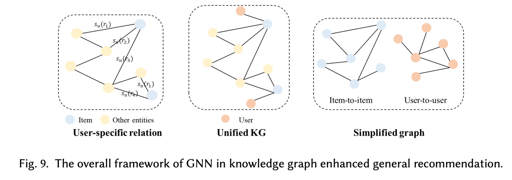

### Representative methods

1. [KGCN](https://arxiv.org/pdf/1904.12575.pdf)对于给定的物品，有偏差地聚合知识图谱中的邻节点的信息，邻居节点的重要程度和用户有关，因为不同用户对不同物品关系的关注度不一样，聚合的参数为<bar>
$a_{r_{e_i, e_j}}^u=u\top r_{e_i, e_j}$$$$\hat a_{r_{e_i,e_j}}^u=\frac {exp(a_{r_{e_i,e_j}}^u)}{\sum_{k \in N(e_i)}exp(a_{r_{e_i,e_k}}^u)}$

<bar>知识图谱中利用GAT进行信息传播，但是重要度有用户和物品关系决定。最终的预测结果有用户embedding和物品embedding决定

2. [KGNN-LS](https://arxiv.org/abs/1905.04413)的目的是通过给用户识别重要的KG关系来学习用户特定的物品embeddings，该方法提出一个关系打分函数来计算关系对特定用户的重要性，此时KG图可以表示成用户特定的邻接矩阵，复杂的KG图可以看作一个传统的图，可以应用GCN计算
$A_u^{ij}=s_u(r_{e_i,e_j})=g(u,r_{e_i,e_j})$

$H_{l+1}=\sigma(D_u^{-\frac 12}A_uD_u^{-\frac 12}H_lW_l),l=0,1,\cdots,L-1$

$g(\cdot)$是一个可微的函数，如内积。
该方法还创新性地提出了一种标签平滑正则计算，假设了KG中相邻的物品具有相似的用户相关性标签，有助于模型泛化到未出现的用户-物品交互
$$E(l_u,A_u)=\frac 12 \sum_{e_i \in \epsilon,e_j \in \epsilon}A_u^{ij}(l_u(e_i)-l_u(e_j))^2$$

3. [KGAT](https://arxiv.org/abs/1905.07854)将二部图和知识图谱整合成了一个图，将用户看作KG中的节点，用户-物品的交互看作一种关系。这种方法一方面统一了信息传递操作，另一方面也可能引入额外噪声。模型使用GAT挖掘实体间的关系，学习用户和物品的embedding
$a(h,r,t)=(W_re_t)\top tanh(W_re_h+e_r)$

$\hat a(h,r,t)=\frac {exp(a(h,r,t))}{\sum_{(h,r',t') \in N_h}exp(a(h,r',t'))}$

另外，该方法引入TransR对实体的embedding进行正则化，正则化的loss和用户-物品预估分数交互学习
$$g(h,r,t)=||W_re_h+e_r-W_re_t||_2^2$$
$$L_{KG}=\sum_{(h,r,t,t') \in \tau}-ln\sigma(g(h,r,t')-g(h,r,t))$$

4. [IntentGC](https://arxiv.org/abs/1907.12377)

5. [AKGE](https://arxiv.org/abs/1905.07854)利用节点embedding的距离以及最短路径算法构造用户-物品的高阶子图，利用attention机制聚合邻居节点信息，使用GRU来整合中心节点以及邻节点的embedding.
$$a_l^t=(A_{s_l} \circ Q_l^t)[\hat h_1^{t-1},\cdots,\hat h_{|\epsilon_s|}^{t-1}]\top +b$$
$$\hat h_k^t=g(h_k^t \oplus r_{l,k})$$
$$\alpha_{l,k}^t=w_2^T\cdot (W_1\cdot[\hat h_k^{t-1}\oplus h_l^{t-1}]+b_1)+b_2$$
$$q_{l,k}^t=\frac {exp(\alpha_{l,k}^t)}{\sum_{e_j \in N_l}exp(\alpha_{l,j}^t)}$$

### Summary
1. 图简化。知识图谱包含很多实体和关系，直接应用GNN学习很困难。AKGE基于最短路径算法重构子图，IntentGC只保留用户-用户图和物品-物品图。图简化虽然牺牲一些图信息，但是可以有效提升计算效率。
2. 多种关系的传播。KG的特点是包含多种物品关系，为了区分不同关系的重要性，常用的方法是采用attention机制来聚合邻居节点的信息。因为attention函数决定的信息的传播，因此会极大地影响模型效果。为了区分邻居节点的影响，主要是考虑用户-关系，以及物品节点-关系的组合。
3. 用户信息整合。相对于用户-物品的二部图，知识图谱属于辅助信息，但是一般知识图谱图的规模要大于二部图。一些工作通过GNN学习物品表征并假设用户embedding是不变的，一些工作将二部图和知识图谱整合成一张图，用户当作KG图中的实体。

# Sequential RS
序列推荐系统基于用户最近的活动来预测用户偏好，并推荐出下一个物品。现有方法主要是着重于从用户的物品序列中捕捉用户的临时偏好，首先将序列化数据转化成序列图，然后用GNN来捕捉这种序列化知识，也有部分工作来辅助信息来帮助学习这种序列化知识。

## Without side information
现有的大部分方法主要使用循环网络来捕捉序列化信息，例如LSTM、GRU等，由于transformer在序列建模方面的突出能力，一些方法利用self-attention来捕捉用户的动态偏好。最近有许多工作通过将用户行为序列建模成图，然后使用GNN来增强行为预测。

### Overall framework

在序列推荐系统中应用GNN需要解决以下问题：
1. 图构造。在序列推荐系统中应用GNN，首先需要将序列化的数据构造成序列图，图的好坏决定了GNN模型效果的好坏
2. 信息传播。构造好序列图之后，需要设计一种有效的信息传播机制来捕捉transition patterns
3. 序列偏好。为了获得用户的临时偏好，需要整合一个序列中的表征信息。

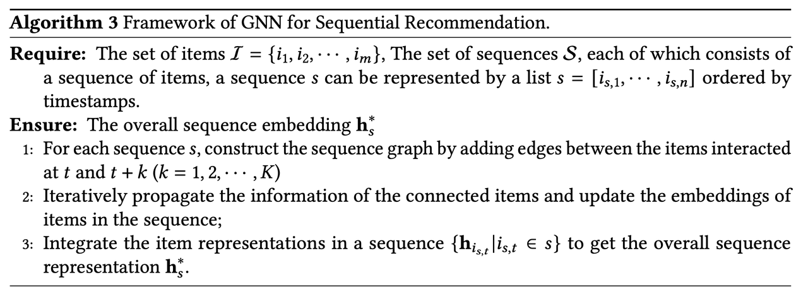

### Representative methods
1. [SR-GNN](https://arxiv.org/abs/1811.00855)为用户的每一个会话构造了一个有向图，两个连续点击的物品之间构造一条有向边，该方法定义了两个邻接矩阵$$A_s^{out}$$,$$A_s^{in}$$分别表示归一化的连接情况，在信息传递的过程中，中心节点的前序点击物品和后续点击物品的信息传递到中心节点
$a_{s,j}^{(l+1)}=[A_{s,j:}^{in}I_s^{(l)}H1,A_{s,j:}^{out}I_s^{(l)}H_2]+b^{(l)}$

其中，$$I_s^{(l)}$$表示第l层网络的物品表征矩阵，由于归一化矩阵，所以邻节点的影响是相等的。
SR-GNN使用GRU来更新节点的embedding
$i_{s,j}^{(l+1)}=GRU(i_{s,j}^{(l)},a_{s,j}^{(l+1)})$

为了获得用户的偏好，该方法组合了用户当前的兴趣以及全局兴趣，使用最后一个点击的物品在最后一层网络中的embedding来表示用户当前兴趣$s_l$，使用soft-attention聚合所有物品的embedding来表示用户的全局兴趣$s_g$。
$$\alpha_j=q\top \sigma(W_1i_n^{(L)}+W_2i_j^{(L)}+c)$$
$$s_g=\sum_{j=1}^n \alpha_ji_j^{(L)}$$
$$h_s^\ast=W_3[s_1;h_g]$$

2. [GC_SAN](https://www.ijcai.org/Proceedings/2019/0547.pdf)采用了和SR-GNN相同的构图和信息传播方式。该方法使用self-attention构造会话的embedding，增强了物品间的交叉，并且在物品的embedding上增加了位置embedding以及l2 normalization

3. [A-PGNN](https://arxiv.org/abs/1910.08887)通过attention建模历史会话对当前会话的影响，以当前会话的embedding作为query，增强了物品间的连接

4. [FGNN](https://arxiv.org/abs/1911.11942)使用GAT来学习物品间的转移关系，给予不同邻节点不同的权重。使用邻节点的加权和来更新中心节点的embedding
$\alpha_{ij}=\frac {exp(LeakyRelu(W_{att}[Wx_i||Wx_j||w_{ij}]))}{\sum_{k \in N(i)}exp(LeakyRelu(W_{att}[Wx_i||Wx_k||w_{ik}))}$

基于会话图的所有节点embedding，该方法利用GRU和attention机制学习一个query向量，用来表示图中的节点顺序
$$q_t=GRU(q_{t-1}^\ast)$$
$$e_{i,t}=f(x_i,q_t)$$
$$a_{i,t}=\frac {exp(e_{i,t})}{\sum_jexp(e_{j,t})}$$
$$r_t=\sum_ia_{i,t}x_i$$
$$q_t^\ast=q_t||r_t$$

### Summary
1. 图构造。现有工作图构造有两种方式，一是如SR-GNN中，连续点击的两个物品间加一条边，另一种是MA-GNN中，当前点击的物品和后续的三个物品间添加边
2. 信息传递。采用mean-pooling或者attention来汇聚邻节点的信息，使用GRU来更新中心节点的embedding
3. 序列偏好。GNN输出的是节点的embedding，需要整个整个序列的节点的embedding得到会话图的embedding。MA-GNN使用mean-pooling，SR-GNN,GC-SAN,A-PGNN使用attention，FGNN使用GRU和attention。

## Social network enhanced
[DGRec](https://arxiv.org/abs/1902.09362)将社交网络看作图数据，利用LSTM从用户最近的会话行为中提取用户的动态兴趣，使用GAT来提取不同朋友的影响。

# Future Research Directions
1. Efficient GNNs for Heterogeneous Graphs
2. Multi-graph Information Integration
3. Scalability of GNNs in Recommendation
4. Sequence Graph Construction for Sequential Recommendation

# Conclusion
